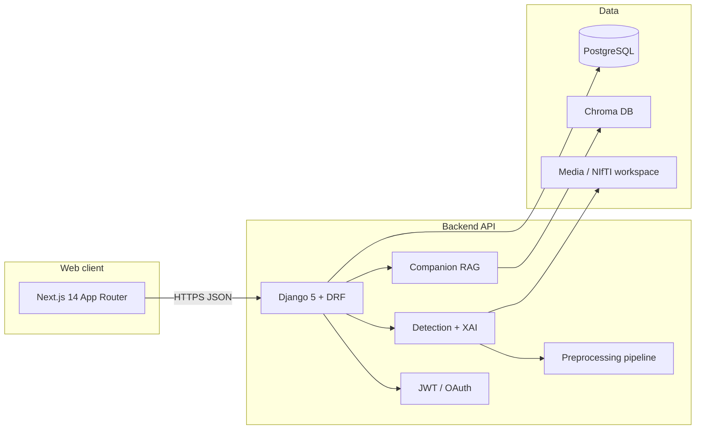

# DementiaNext

**DementiaNext** is a full-stack **AI-assisted clinical decision-support prototype** for brain MRI analysis, built as a **final-year software engineering project**. It combines **3D MRI preprocessing**, **deep learning–based classification**, **explainable AI (Grad-CAM)**, and a **physician workflow** (appointments, reports, optional FHIR) with an **AI companion** for patient education—wrapped in a modern **Next.js** + **Django REST** platform.

| | |
|---|---|
| **Repository** | [github.com/raja-saif/FYP-DementiaNext](https://github.com/raja-saif/FYP-DementiaNext) |
| **Stack** | Next.js 14 · React 18 · TypeScript · Tailwind · Django 5 · Django REST Framework · PostgreSQL · PyTorch |

> **Important:** This system is intended for **research, education, and demonstration** only. It is **not** a medical device and must **not** be used as the sole basis for diagnosis or treatment. Clinical use requires validation, regulatory clearance, and supervision by qualified professionals.

## Highlights

| Area | What we built |
|------|----------------|
| **Imaging pipeline** | End-to-end path from **DICOM / ZIP / NIfTI** to ML-ready volumes (skull-stripping, normalization, and related steps integrated with the backend). |
| **Models** | **Binary** dementia screening and **4-class subtype** classifier (**ResNet-34** backbone): Alzheimer’s disease (AD), Parkinson’s disease (PD), frontotemporal dementia (FTD), control/normal (CN)—with stored probabilities and metadata. |
| **Explainability** | **Grad-CAM** on MRI slices plus **slice-explorer** views aligned with preprocessed NIfTI paths for consistent 3D behavior. |
| **Clinical-style workflow** | **Patient** and **doctor** roles, **appointments**, **patient reports**, optional **FHIR DiagnosticReport**-oriented API surface. |
| **Companion (RAG)** | **Chroma** vector store + **sentence-transformers** embeddings, LLM integration patterns (e.g. **Groq**), and **edge-tts** for spoken responses—designed as a supportive explainer, not an autonomous diagnostician. |
| **Auth & integrations** | **JWT** sessions, email/password, and optional **Google OAuth** (django-allauth / dj-rest-auth + Google Identity flows on the client). |
| **Deployment-ready patterns** | Clear split of **API base URL** for local, **Vercel**, and **container** (e.g. Hugging Face Space) targets; async detection task hook for long-running inference. |

---

## Architecture



---

## Tech stack (summary)

**Frontend:** Next.js 14, React 18, TypeScript, Tailwind CSS, Framer Motion, Recharts, NextAuth (Google), bcrypt password hashing.

**Backend:** Python 3.10+, Django 5.2, DRF, SimpleJWT, django-cors-headers, PostgreSQL (psycopg2), Pillow, django-allauth + dj-rest-auth.

**ML & imaging:** PyTorch, torchvision, nibabel, OpenCV, scikit-learn/scipy/numpy, matplotlib; custom **MRI preprocessing** phases (DICOM→NIfTI, BIDS-oriented layout, phase-2 intensity/registration/skull-strip steps as implemented in `backend/pipeline/`).

**Companion:** chromadb, sentence-transformers, optional **Groq** API, **edge-tts**.

---

## Repository layout

```
backend/
  core/           # Django project settings & URLs
  authx/          # Users, JWT, registration, Google OAuth hooks
  detection/      # MRI upload, inference, Grad-CAM, appointments, FHIR-oriented APIs
  companion/      # RAG companion APIs, Chroma, embeddings
  pipeline/       # MRI preprocessing orchestration (DICOM / ZIP / NIfTI)
  models/         # Trained weights (e.g. subtype_classifier.pth) — large files; consider Git LFS for forks
frontend/
  app/            # Next.js routes (patient/doctor flows, detection UI, companion)
  components/     # Shared UI
  lib/            # API clients, utilities
README.md         # This document
```

---

## Prerequisites

- **Python** 3.10+ (3.12+ supported; match your torch wheels)
- **Node.js** 18+
- **PostgreSQL** running locally (default in settings: `dementianext_db`, user/password `postgres`, port `5432`) or override via env vars
- Optional: **CUDA** for faster PyTorch (CPU works for demos but is slower on full volumes)
- Optional: API keys for **Groq**, **Google OAuth**, etc. (see below)

---

## Quick start (local)

### 1. Database

Create a PostgreSQL database (or use Docker). Defaults match `backend/core/settings.py`; override with:

- `DB_NAME`, `DB_USER`, `DB_PASSWORD`, `DB_HOST`, `DB_PORT`

Copy `backend/.env.example` → `backend/.env` if you maintain one, or export variables in your shell.

### 2. Backend

**Windows (PowerShell)**

```powershell
cd backend
python -m venv .venv
.\.venv\Scripts\Activate.ps1
pip install -r requirements.txt
python manage.py migrate
python manage.py runserver 8000
```

**Linux / macOS**

```bash
cd backend
python3 -m venv .venv && source .venv/bin/activate
pip install -r requirements.txt
python manage.py migrate
python manage.py runserver 8000
```

API base: **http://127.0.0.1:8000**

### 3. Frontend

**Windows (PowerShell)**

```powershell
cd frontend
@"
NEXT_PUBLIC_API_BASE_URL=http://127.0.0.1:8000
"@ | Out-File -Encoding UTF8 .env.local
npm install
npm run dev
```

**Linux / macOS**

```bash
cd frontend
echo "NEXT_PUBLIC_API_BASE_URL=http://127.0.0.1:8000" > .env.local
npm install
npm run dev
```

App: **http://localhost:3000** (Next may pick **3001** if 3000 is busy).

---

## Environment variables (cheat sheet)

| Variable | Where | Purpose |
|----------|--------|---------|
| `NEXT_PUBLIC_API_BASE_URL` | `frontend/.env.local` | Django API origin used by the browser |
| `DJANGO_SECRET_KEY`, `DJANGO_DEBUG` | `backend` env | Standard Django settings |
| `DB_*` | `backend` env | PostgreSQL connection |
| `GOOGLE_CLIENT_ID`, `GOOGLE_CLIENT_SECRET` | `backend` env | Google OAuth token exchange |
| `NEXT_PUBLIC_GOOGLE_CLIENT_ID` | `frontend/.env.local` | Google Identity Services |
| `GROQ_API_KEY` (if used) | `backend` env | Companion LLM backend |

Optional flags such as **`ASYNC_DETECTION`** may be used in hosted environments to enqueue long-running jobs—see `backend/detection/tasks.py` and related views.

---

## API overview

Base paths (all under the API host):

| Prefix | Area |
|--------|------|
| `/api/` | Auth: register, login, verify, Google token exchange |
| `/api/detection/` | Detections CRUD, upload/inference, explainability & slice endpoints, models metadata, appointments, doctors, patient reports, FHIR-oriented reports |
| `/api/companion/` | RAG companion chat, knowledge ingestion utilities (as implemented) |

Representative **auth** endpoints used by the SPA:

- `POST /api/register` → token + user  
- `POST /api/login` → token + user  
- `POST /api/auth/verify` → user from token  
- `POST /api/auth/google` → token + user (when OAuth is configured)

---

## Google OAuth (optional)

1. Create an OAuth **Web client** in [Google Cloud Console](https://console.cloud.google.com/).
2. Add **JavaScript origins** for each dev/prod host you use (`http://localhost:3000`, `http://127.0.0.1:3000`, production `https://…`).
3. Add **redirect URIs** required by your auth flow (e.g. NextAuth callbacks:  
   `http://localhost:3000/api/auth/callback/google` — mirror for `127.0.0.1` and production).
4. Set backend: `GOOGLE_CLIENT_ID`, `GOOGLE_CLIENT_SECRET`; frontend: `NEXT_PUBLIC_GOOGLE_CLIENT_ID`.
5. Restart Django and Next.js after changes.

If OAuth is not configured, **email/password** authentication still works.

---

## Troubleshooting

### Ports in use (Windows)

```powershell
netstat -ano | findstr :8000
taskkill /PID <pid> /F
```

### Verify backend responds

```powershell
Invoke-WebRequest -Uri "http://127.0.0.1:8000/api/auth/verify" -Method POST `
  -Headers @{'Content-Type'='application/json'} -Body '{"token":"invalid"}'
```

### Google `redirect_uri_mismatch`

Ensure **origins** and **redirect URIs** in Google Cloud match the **exact** scheme/host/port you type in the browser, including `localhost` vs `127.0.0.1`.

### Large model files

GitHub warns on blobs **> 50 MB**. Weights under `backend/models/` may exceed that; for collaboration, prefer **Git LFS** or artifact storage in forks.

### Push / HTTP timeouts

For large packs over slow links, raise buffers and retry, e.g.:

```powershell
git -c http.postBuffer=1048576000 -c http.lowSpeedLimit=0 -c http.lowSpeedTime=999999 push origin main
```

---

## Deployment notes

- **Frontend:** Deploy on **Vercel** (or similar); set `NEXT_PUBLIC_API_BASE_URL` to your production API URL.
- **Backend:** Deploy on a Python host **or** a **Docker / Hugging Face Space**-style container; ensure **PostgreSQL** (or managed equivalent), **persistent media volume**, and environment variables are set.
- **CORS / CSRF:** Tighten `ALLOWED_HOSTS`, CORS, and cookie settings for real production; current defaults favor demos.

---

## Academic & career context

This project demonstrates **end-to-end product engineering**: requirements → architecture → secure APIs → ML operations → responsible-AI affordances (**explainability**, **disclaimers**, audit-friendly logs) → modern UX. It is well suited for discussion at **job fairs**, **technical interviews**, and **capstone review boards**.

**Suggested talking points**

1. Trade-offs between **async jobs** and synchronous inference for MRI workloads.  
2. Why **NIfTI path resolution** and preprocessing parity matter for **XAI** consistency.  
3. How **RAG** reduces verbatim hallucinations in patient education—within strict safety bounds.

---

## Contributing & license

Issues and pull requests are welcome for educational forks. Specify your institution’s license if you extend this codebase for credit-bearing work.

---

## Acknowledgments

Built as **FYP-DementiaNext** with open-source tools (PyTorch, Django, Next.js, Chroma, and the broader scientific Python ecosystem). Thanks to maintainers of the libraries listed in `backend/requirements.txt` and `frontend/package.json`.
